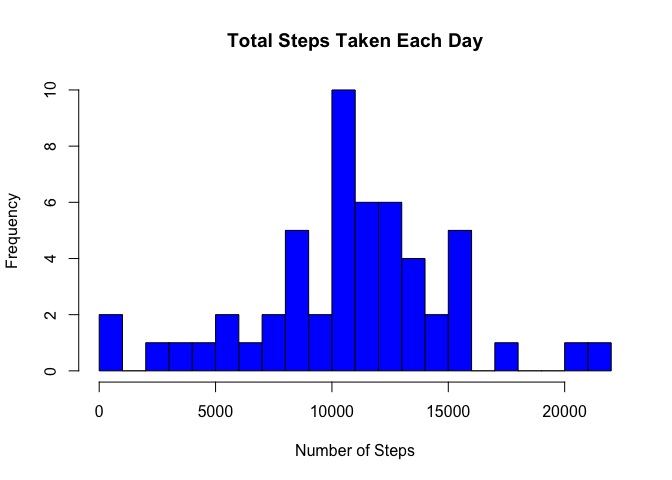

# Loading and Preprocessing the Data

For this assignment, we load the activity data from the provided CSV file and convert the date column to Date format.


``` r
library(ggplot2)
activity_data <- read.csv("activity.csv", stringsAsFactors = FALSE)
activity_data$date <- as.Date(activity_data$date)
head(activity_data)
```

```
##   steps       date interval
## 1    NA 2012-10-01        0
## 2    NA 2012-10-01        5
## 3    NA 2012-10-01       10
## 4    NA 2012-10-01       15
## 5    NA 2012-10-01       20
## 6    NA 2012-10-01       25
```

# Mean Total Number of Steps Taken Per Day

We calculate the total number of steps taken per day by summing steps across all intervals for each date, ignoring missing values.


``` r
total_steps_per_day <- aggregate(steps ~ date, data = activity_data, sum, na.rm = TRUE)

hist(total_steps_per_day$steps,
     main = "Total Steps Taken Each Day",
     xlab = "Number of Steps",
     col = "blue",
     breaks = 30)
```

<!-- -->

``` r
mean_steps <- mean(total_steps_per_day$steps)
median_steps <- median(total_steps_per_day$steps)
```

Answer:  
The mean total number of steps taken per day is approximately 10766.19.  
The median total number of steps taken per day is 10765.

# Average Daily Activity Pattern

Next, we examine the average daily activity pattern by calculating the average number of steps taken in each 5-minute interval, averaged across all days.


``` r
avg_steps_per_interval <- aggregate(steps ~ interval, data = activity_data, mean, na.rm = TRUE)

ggplot(avg_steps_per_interval, aes(x = interval, y = steps)) +
  geom_line() +
  labs(title = "Average Daily Activity Pattern",
       x = "5-minute Interval",
       y = "Average Number of Steps") +
  theme_minimal()
```

<!-- -->

# 5-minute Interval with Maximum Average Steps

We identify the 5-minute interval which, on average, contains the maximum number of steps.


``` r
max_interval <- avg_steps_per_interval$interval[which.max(avg_steps_per_interval$steps)]
max_steps <- max(avg_steps_per_interval$steps)
```

Answer:  
The 5-minute interval with the maximum average steps is 835 with an average of 206.17 steps.

# Total Number of Missing Values

We calculate the total number of missing values in the steps column.


``` r
total_missing <- sum(is.na(activity_data$steps))
```

Answer:  
Total missing values in the ‘steps’ column: 2304

# Imputing Missing Values

We fill missing values by replacing each NA with the mean steps for that 5-minute interval.


``` r
activity_imputed <- activity_data
for(i in which(is.na(activity_imputed$steps))) {
  interval_val <- activity_imputed$interval[i]
  activity_imputed$steps[i] <- avg_steps_per_interval$steps[avg_steps_per_interval$interval == interval_val]
}
missing_after_imputation <- sum(is.na(activity_imputed$steps))
```

Answer:  
Missing values after imputation: 0

# Histogram After Imputation

We plot a histogram of the total steps taken each day after imputing missing values.


``` r
total_steps_imputed <- aggregate(steps ~ date, data = activity_imputed, sum)

hist(total_steps_imputed$steps,
     main = "Total Steps Taken Each Day (After Imputation)",
     xlab = "Number of Steps",
     col = "green",
     breaks = 30)
```

<!-- -->

``` r
mean_imputed <- mean(total_steps_imputed$steps)
median_imputed <- median(total_steps_imputed$steps)
```

Answer:  
The mean total steps after imputation is approximately 10766.19.  
The median total steps after imputation is 10766.19.

Imputing missing data by replacing missing steps with the interval average results in a slightly smoother daily activity estimate. The overall mean and median total daily steps remain nearly unchanged, suggesting that the missing data did not substantially bias the initial estimates.

# Activity Patterns: Weekdays vs Weekends

We classify each date as either a weekday or weekend and compare average steps per interval for these two categories.

The panel plot comparing weekdays and weekends shows different activity patterns, likely reflecting workday versus leisure day behaviors.


``` r
activity_imputed$day_type <- ifelse(weekdays(activity_imputed$date) %in% c("Saturday", "Sunday"),
                                   "weekend", "weekday")
activity_imputed$day_type <- factor(activity_imputed$day_type, levels = c("weekday", "weekend"))

avg_steps_daytype <- aggregate(steps ~ interval + day_type, data = activity_imputed, mean)

ggplot(avg_steps_daytype, aes(x = interval, y = steps)) +
  geom_line() +
  facet_wrap(~ day_type, ncol = 1, scales = "free_y") +
  labs(title = "Average Steps per Interval: Weekday vs Weekend",
       x = "5-minute Interval",
       y = "Average Number of Steps") +
  theme_minimal()
```

<!-- -->
